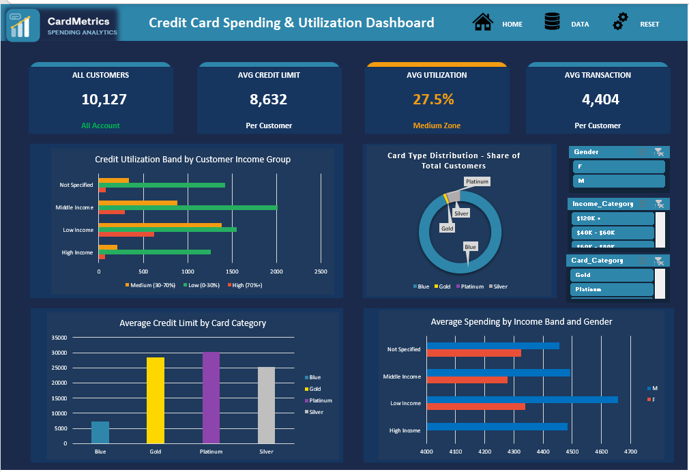
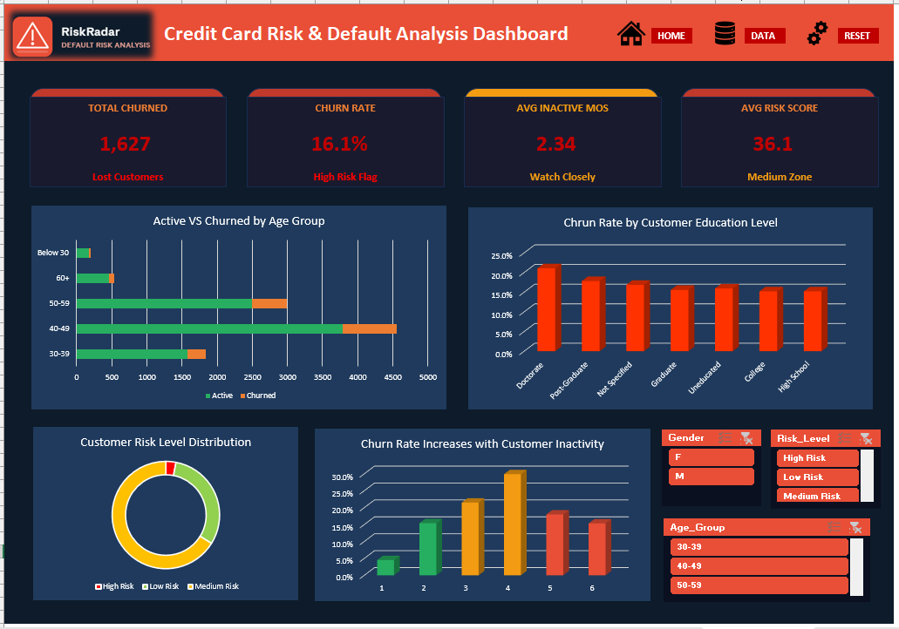
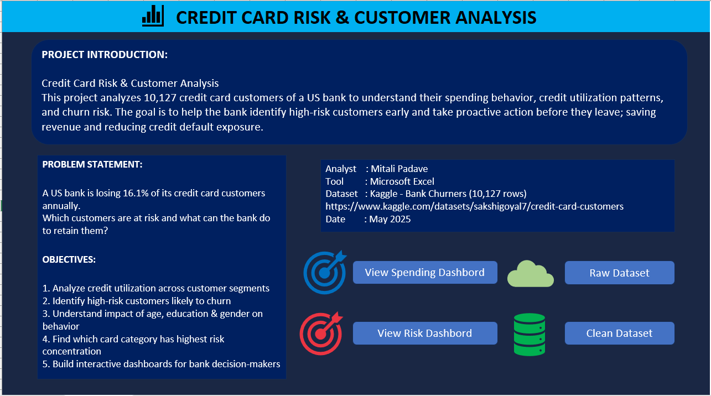
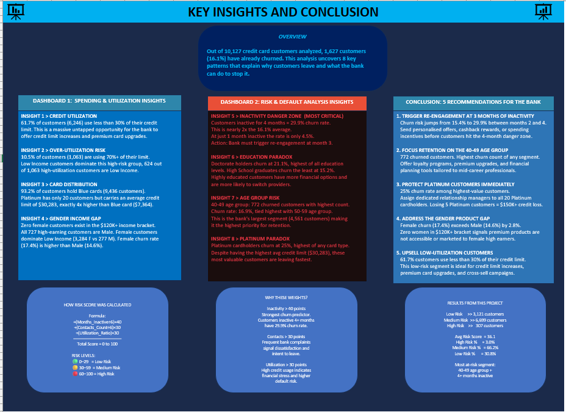

# Credit Card Risk & Customer Analysis

## Project Overview
Analyzed **10,127 credit card customers** of a US bank 
to understand spending behavior, credit utilization, 
and churn risk using Microsoft Excel.

**Problem Statement:**
A US bank is losing 16.1% of its credit card customers 
annually. Which customers are at risk and what can the 
bank do to retain them?

---

## 📊 Dashboard Preview

### Dashboard 1: Spending & Utilization

### Dashboard 2: Risk & Default Analysis

### Introduction Sheet

### Insights Sheet

---

## Key Findings

| # | Finding | Number |
|---|---------|--------|
| 1 | Customers inactive 4+ months churn rate | 29.9% |
| 2 | Doctorate holders churn the most | 21.1% |
| 3 | Highest churn age group (40-49) | 772 customers |
| 4 | Platinum card churn rate | 25% |
| 5 | Zero female customers in $120K+ bracket | Gender gap |
| 6 | Low utilization customers | 61.7% |

---

## Excel Skills Used

- Data Cleaning & Transformation
- Nested IF / OR Formulas
- Custom Weighted Risk Score Formula
- 9 Named Pivot Tables
- GETPIVOTDATA for live KPI cards
- 8 PivotCharts
- Custom Slicer Styles + Report Connections
- Shape-Based KPI Cards
- Navigation Buttons with Hyperlinks
- VBA ResetSlicers() Macro

---
