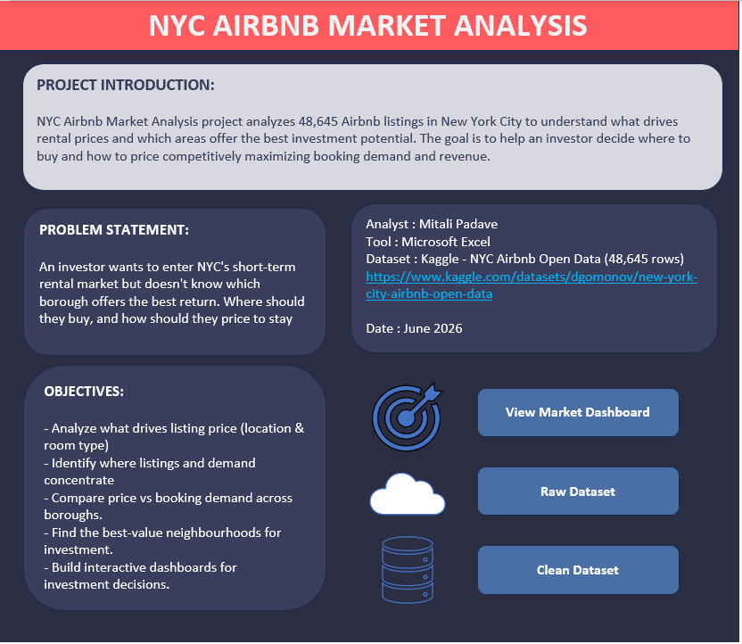
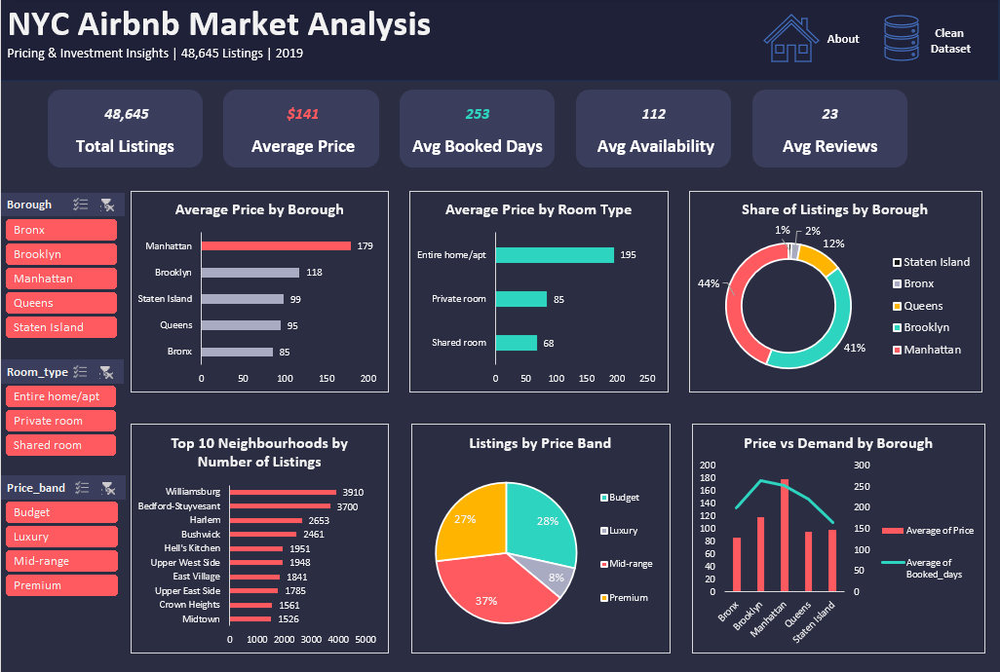
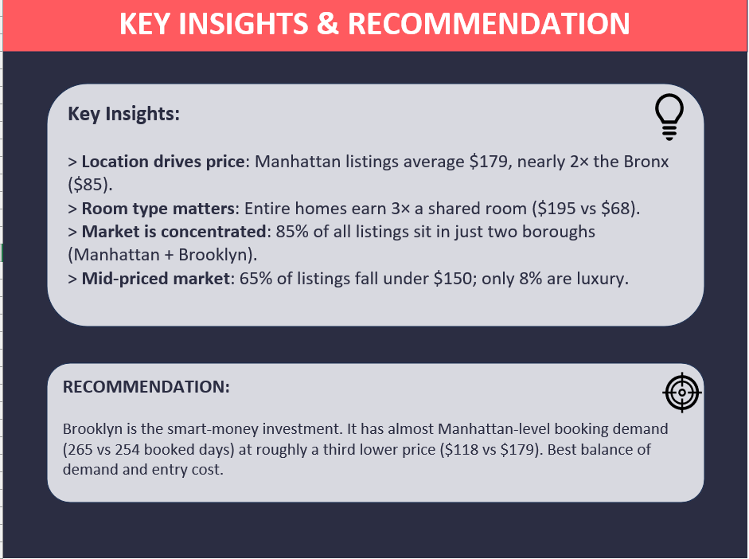

# 🏙️ NYC Airbnb Market Analysis — Pricing & Investment Dashboard

An interactive **Excel dashboard** analysing **48,645 New York City Airbnb listings** to answer a real business question: *which borough offers the best investment return, and how should a host price to stay competitive?*

> **Key takeaway:** Brooklyn is the smart-money investment. It has almost Manhattan-level booking demand at roughly a third lower price.

---

## Business Problem

An investor wants to enter NYC's short-term rental market but doesn't know where to buy or how to price. This project turns 48,645 raw listings into a clear, data-backed recommendation on **where the best value and demand are**.

---

## Objectives

1. Identify what drives listing price (location & room type)
2. Find where listings and demand concentrate across the city
3. Compare price vs booking demand across all five boroughs
4. Highlight the best-value neighbourhoods for investment
5. Build an interactive dashboard for quick, filterable decision-making

---

## Tools & Skills

- **Microsoft Excel**: PivotTables, PivotCharts, Slicers, calculated columns
- **Data cleaning**: outlier removal, handling missing values
- **Data visualisation**: KPI cards, bar/donut/pie/combo charts
- **Dashboard design**: interactive filtering, layout, storytelling

---

## 📊 Dataset

- **Source:** [New York City Airbnb Open Data : Kaggle](https://www.kaggle.com/datasets/dgomonov/new-york-city-airbnb-open-data)
- **Size:** 48,895 raw rows > **48,645 after cleaning**, 19 columns (incl. calculated)
- **Period:** 2019

### Data Cleaning Performed
- Removed listings priced at **$0** (data errors)
- Removed extreme outliers priced **above $1,000**
- Filled missing `reviews_per_month` values with 0 (listings with no reviews)
- Added 3 calculated columns: `Price_band`, `Booked_days` (365 − availability, a demand proxy), `Has_reviews`

---

## Key Insights

| # | Insight |
|---|---------|
| 1 | **Location drives price:** Manhattan averages **$179**, nearly 2× the Bronx (**$85**) |
| 2 | **Room type matters:** entire homes earn ~3× a shared room (**$195 vs $68**) |
| 3 | **Highly concentrated market:** **85%** of all listings are in just two boroughs (Manhattan + Brooklyn) |
| 4 | **Mid-priced market:** 65% of listings fall under $150; only **8%** are luxury |
| 5 | **Brooklyn punches above its price:** near-Manhattan demand (**265 vs 254** booked days) at a far lower price point |

---

## 💡 Recommendation

> **Brooklyn is the smart-money investment.** It delivers almost the same booking demand as Manhattan (265 vs 254 booked days/year) at roughly **a third lower price** ($118 vs $179) — the best balance of demand and entry cost. Manhattan remains the premium play; the Bronx and Staten Island are low-priced *and* low-demand, offering weaker returns.

---

## Dashboard Structure

| Sheet | Purpose |
|-------|---------|
| **Introduction** | Project overview, problem statement, objectives |
| **Raw_data** | Original uncleaned dataset (for transparency) |
| **Data** | Cleaned dataset + calculated columns |
| **Pivots** | All PivotTables powering the charts |
| **Dashboard** | Interactive dashboard with KPIs, 6 charts & slicers |
| **Insights** | Key findings & investment recommendation |

### Dashboard Features
- **5 KPI cards:** total listings, average price, avg booked days, avg availability, avg reviews
- **6 charts:** price by borough, price by room type, listings share, top 10 neighbourhoods, price bands, price vs demand
- **3 interactive slicers:** filter the entire dashboard by Borough, Room Type, and Price Band

---

## Dashboard Preview

---

## How to Use

1. Download `AB_NYC_2019.xlsx`
2. Open in Microsoft Excel (desktop recommended for slicer interactivity)
3. Use the slicers on the Dashboard sheet to filter by borough, room type, or price band
4. Click the navigation buttons on the Introduction sheet to jump between views

---
